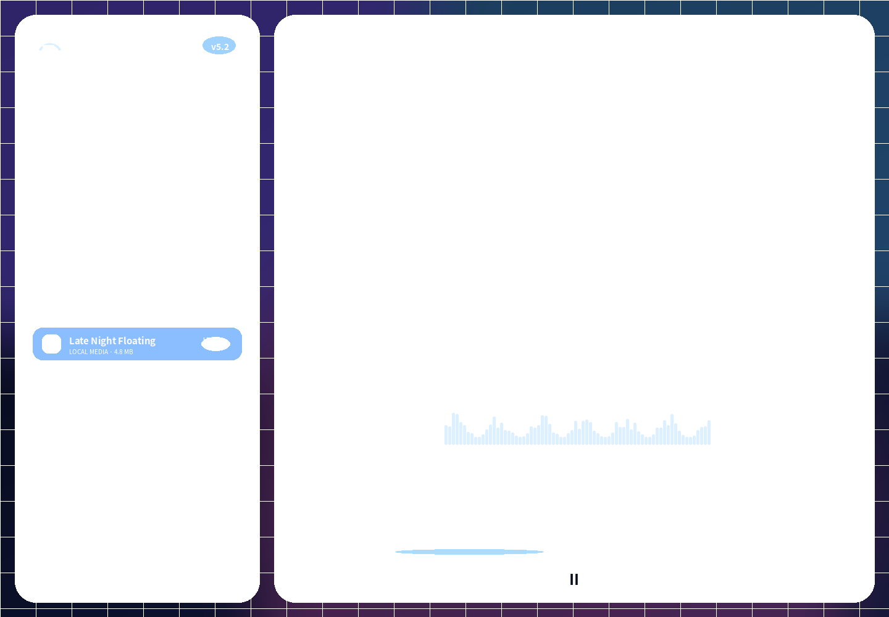
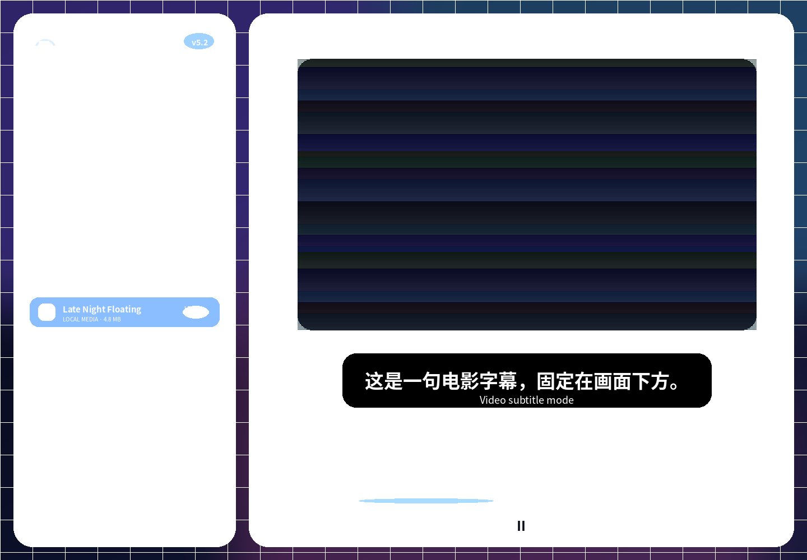
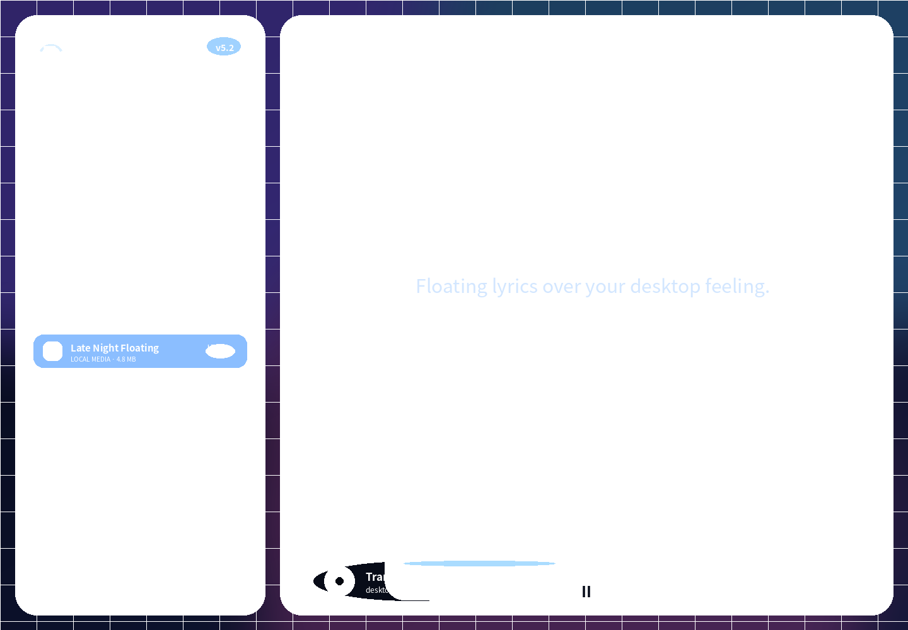
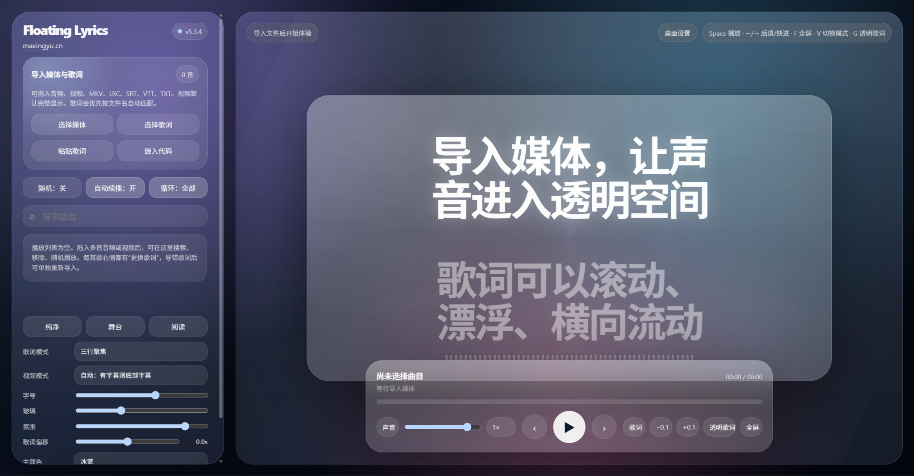
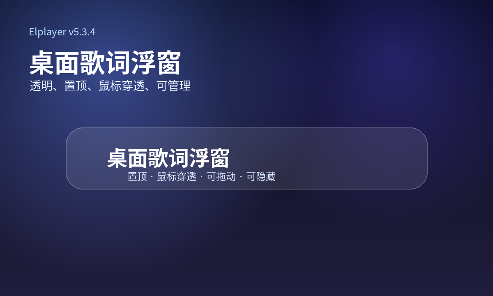
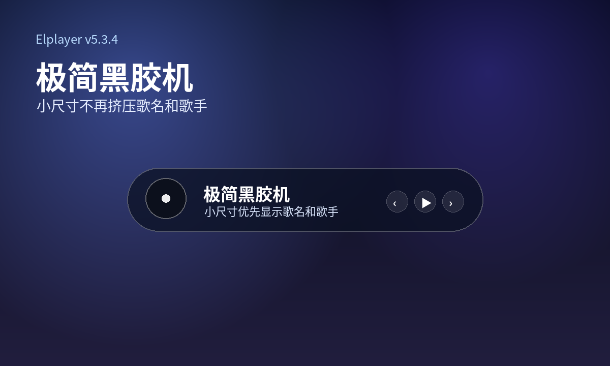
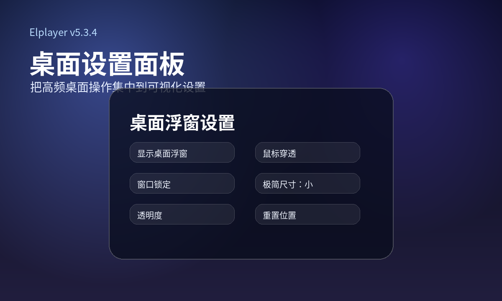

# Elplayer

**Elplayer 是一个面向本地音频、本地视频、歌词、字幕和桌面歌词场景的透明浮动歌词多媒体播放器。**

它不是传统意义上的“纯音乐播放器”。它可以用于听歌、看 MV、播放电影片段、展示课程字幕，也可以作为个人网站中的沉浸式媒体组件使用。v5.3.4 重点修复窗口化布局、极简黑胶机小尺寸显示、中文优先发布物料，并补齐真实发布前需要的官网、下载页和 macOS 签名/公证准备文件。

> English summary: Elplayer is a transparent floating lyrics multimedia player for local audio, video, lyrics, subtitles, desktop lyrics overlay, and website embedding.


## 项目截图

| 桌面主界面 | 视频字幕模式 |
| --- | --- |
|  |  |

| 透明歌词 | 移动端界面 |
| --- | --- |
|  |  |

## v5.3.4 发布物料

| 发布封面 | 桌面歌词浮窗 |
| --- | --- |
|  |  |

| 极简黑胶机 | 桌面设置面板 |
| --- | --- |
|  |  |

常用入口：

- [官网展示页](website.html)
- [下载页](download.html)
- [安装包使用说明](docs/installer-usage.md)
- [发布物料说明](docs/release-assets.md)
- [首次启动与更新弹窗说明](docs/first-run-experience.md)
- [macOS 签名与公证说明](docs/macos-signing-notarization.md)

## 功能特性

- 本地音频播放
- 本地视频播放
- LRC 歌词解析
- SRT / VTT 字幕解析
- TXT 普通歌词自动生成时间轴
- 桌面歌词浮窗
- 极简黑胶机浮窗
- 视频字幕模式
- 透明歌词模式
- 播放列表、随机播放、循环播放
- 歌词偏移校准
- 多种歌词显示样式
- 窗口化紧凑布局适配
- 移动端 / PWA 基础适配
- 个人网站嵌入模式

## 支持格式

| 类型 | 格式 |
| --- | --- |
| 音频 | MP3, M4A, AAC, WAV, FLAC, OGG, OPUS |
| 视频 | MP4, M4V, MOV, WEBM, OGV, MKV, AVI |
| 歌词 | LRC, TXT |
| 字幕 | SRT, VTT |

> MKV / AVI 能否播放取决于系统和 Chromium 编码支持。公开发布时建议优先使用 MP4 / H.264 / AAC。

## 快速开始

### 1. 运行 Web 版

直接打开 `index.html`，或启动本地静态服务：

```bash
python -m http.server 5173
```

然后访问：

```text
http://localhost:5173
```

### 2. 运行桌面版

```bash
npm install
npm run desktop
```

### 3. 构建 Windows 安装包

```bash
npm run release:check
npm run dist:win
```

默认只构建 Windows x64 安装包，避免不必要的 ia32 下载失败。

### 4. 构建 macOS 安装包

```bash
npm run dist:mac
```

macOS 对外分发前应完成 Developer ID 签名与 Apple 公证。详见 [docs/macos-signing-notarization.md](docs/macos-signing-notarization.md)。

## 快捷键

| 快捷键 | 功能 |
| --- | --- |
| Space | 播放 / 暂停 |
| ← / → | 后退 / 快进 |
| N / P | 下一首 / 上一首 |
| F | 沉浸模式 |
| G | 透明歌词模式 |
| V | 切换视频模式 |
| L | 显示 / 隐藏歌词 |
| [ / ] | 调整歌词偏移 |
| M | 静音 |
| Esc | 退出弹窗 / 全屏 |
| Ctrl / Cmd + Shift + L | 显示 / 隐藏桌面浮窗 |
| Ctrl / Cmd + Shift + M | 切换桌面歌词 / 极简黑胶机 |
| Ctrl / Cmd + Shift + P | 开启 / 关闭鼠标穿透 |
| Ctrl / Cmd + Shift + S | 打开桌面设置 |

## 嵌入模式

```text
index.html?embed=1
```

该模式会隐藏左侧面板，适合把播放器嵌入个人网站页面。

## 当前版本

```text
v5.3.4
```

当前技术实现：

```text
HTML + CSS + JavaScript + Electron
```

## 文档

- [使用说明](docs/usage.md)
- [路线图](docs/roadmap.md)
- [更新日志](docs/changelog.md)
- [部署说明](docs/deployment.md)
- [Electron 桌面版说明](docs/electron.md)
- [桌面设置说明](docs/desktop-settings.md)
- [Windows 安装包说明](docs/windows-installer.md)
- [安装包使用说明](docs/installer-usage.md)
- [发布物料说明](docs/release-assets.md)
- [官网与下载区说明](docs/website-download-section.md)
- [首次启动与更新弹窗说明](docs/first-run-experience.md)
- [macOS 签名与公证说明](docs/macos-signing-notarization.md)
- [发布流程说明](docs/release-publishing.md)

## 作者

**马星煜**

- Website: https://maxingyu.cn
- GitHub: https://github.com/xingyu8999

## License

MIT License
